# 📊 PeakPH Commerce - Data Model Design

## 5. Data Model Design

The Data Model Design serves as the blueprint for the PeakPH Commerce relational database, defining the structure, relationships, and constraints that govern data storage and retrieval for the e-commerce platform.

### 5.1. Main Tables (Entities)

---

#### 5.1.1 **Core Business Tables**

##### **`inventory`** - Product Management
| Attribute | Data Type | Constraints | Description |
|-----------|-----------|-------------|-------------|
| `id` | INT(11) | PRIMARY KEY, AUTO_INCREMENT, NOT NULL | Unique product identifier |
| `product_name` | VARCHAR(255) | NOT NULL | Product display name |
| `price` | DECIMAL(10,2) | NOT NULL | Product price in PHP |
| `stock` | INT(11) | NOT NULL | Available quantity |
| `tag` | VARCHAR(50) | DEFAULT NULL | Product category/tag |
| `image` | VARCHAR(255) | DEFAULT NULL | Product image file path |
| `label` | VARCHAR(50) | DEFAULT NULL | Product labels (Best Seller, New, etc.) |
| `created_at` | TIMESTAMP | NOT NULL, DEFAULT CURRENT_TIMESTAMP | Record creation time |
| `updated_at` | TIMESTAMP | NOT NULL, DEFAULT CURRENT_TIMESTAMP ON UPDATE CURRENT_TIMESTAMP | Last modification time |

**Indexes:**
- `idx_inventory_tag` ON (`tag`)
- `idx_inventory_stock` ON (`stock`)
- `idx_inventory_created` ON (`created_at`)

---

##### **`products`** - Catalog Compatibility Layer
| Attribute | Data Type | Constraints | Description |
|-----------|-----------|-------------|-------------|
| `id` | INT(11) | PRIMARY KEY, AUTO_INCREMENT, NOT NULL | Unique product identifier |
| `name` | VARCHAR(255) | NOT NULL | Product name |
| `price` | DECIMAL(10,2) | NOT NULL | Product price |
| `image_path` | VARCHAR(255) | DEFAULT NULL | Image file location |
| `category` | VARCHAR(100) | DEFAULT NULL | Product category |
| `description` | TEXT | DEFAULT NULL | Detailed product description |
| `stock` | INT(11) | DEFAULT 0 | Available inventory |
| `status` | ENUM('Active','Inactive') | NOT NULL, DEFAULT 'Active' | Product availability status |
| `created_at` | TIMESTAMP | NOT NULL, DEFAULT CURRENT_TIMESTAMP | Creation timestamp |
| `updated_at` | TIMESTAMP | NOT NULL, DEFAULT CURRENT_TIMESTAMP ON UPDATE CURRENT_TIMESTAMP | Update timestamp |

**Indexes:**
- `idx_products_category` ON (`category`)
- `idx_products_status` ON (`status`)

---

#### 5.1.2 **User Management Tables**

##### **`users`** - User Authentication & Profiles
| Attribute | Data Type | Constraints | Description |
|-----------|-----------|-------------|-------------|
| `id` | INT(11) | PRIMARY KEY, AUTO_INCREMENT, NOT NULL | Unique user identifier |
| `username` | VARCHAR(100) | NOT NULL | User display name |
| `email` | VARCHAR(150) | NOT NULL, UNIQUE | User email address |
| `password` | VARCHAR(255) | NOT NULL | Hashed password (Argon2ID) |
| `role` | ENUM('User','Admin') | NOT NULL, DEFAULT 'User' | User access level |
| `status` | ENUM('Active','Inactive') | NOT NULL, DEFAULT 'Active' | Account status |
| `created_at` | TIMESTAMP | NOT NULL, DEFAULT CURRENT_TIMESTAMP | Registration timestamp |
| `updated_at` | TIMESTAMP | NOT NULL, DEFAULT CURRENT_TIMESTAMP ON UPDATE CURRENT_TIMESTAMP | Profile update timestamp |

**Indexes:**
- `idx_users_email` ON (`email`)
- `idx_users_role` ON (`role`)

---

##### **`otp_verifications`** - Email Verification System
| Attribute | Data Type | Constraints | Description |
|-----------|-----------|-------------|-------------|
| `id` | INT | PRIMARY KEY, AUTO_INCREMENT | Unique OTP record identifier |
| `email` | VARCHAR(255) | NOT NULL | Target email address |
| `otp_code` | VARCHAR(6) | NOT NULL | 6-digit verification code |
| `signup_data` | TEXT | NOT NULL | JSON-encoded registration data |
| `attempts` | INT | DEFAULT 0 | Failed verification attempts |
| `created_at` | TIMESTAMP | DEFAULT CURRENT_TIMESTAMP | OTP generation time |
| `expires_at` | DATETIME | NOT NULL | OTP expiration time |
| `is_verified` | TINYINT(1) | DEFAULT 0 | Verification status flag |
| `ip_address` | VARCHAR(45) | DEFAULT NULL | Request source IP |
| `user_agent` | TEXT | DEFAULT NULL | Browser/client information |

**Indexes:**
- `idx_email` ON (`email`)
- `idx_otp` ON (`otp_code`)
- `idx_expires` ON (`expires_at`)

---

##### **`rate_limits`** - Security & Rate Limiting
| Attribute | Data Type | Constraints | Description |
|-----------|-----------|-------------|-------------|
| `id` | INT | PRIMARY KEY, AUTO_INCREMENT | Unique rate limit record |
| `email` | VARCHAR(255) | NOT NULL | Target email address |
| `attempt_type` | VARCHAR(50) | NOT NULL | Type of attempt (login, signup, etc.) |
| `attempts` | INT | DEFAULT 1 | Number of attempts |
| `last_attempt` | TIMESTAMP | DEFAULT CURRENT_TIMESTAMP | Most recent attempt time |
| `expires_at` | DATETIME | NOT NULL | Rate limit expiration |
| `ip_address` | VARCHAR(45) | DEFAULT NULL | Source IP address |

**Indexes:**
- `idx_email_type` ON (`email`, `attempt_type`)
- `idx_expires` ON (`expires_at`)

---

#### 5.1.3 **E-commerce Transaction Tables**

##### **`orders`** - Customer Orders
| Attribute | Data Type | Constraints | Description |
|-----------|-----------|-------------|-------------|
| `id` | INT(11) | PRIMARY KEY, AUTO_INCREMENT, NOT NULL | Unique order identifier |
| `user_id` | INT(11) | DEFAULT NULL, FOREIGN KEY → `users(id)` | Customer reference (NULL for guests) |
| `customer_name` | VARCHAR(255) | NOT NULL | Customer full name |
| `customer_email` | VARCHAR(150) | NOT NULL | Customer contact email |
| `customer_phone` | VARCHAR(20) | DEFAULT NULL | Customer phone number |
| `total_amount` | DECIMAL(10,2) | NOT NULL | Order total value |
| `status` | ENUM('Pending','Processing','Shipped','Delivered','Cancelled') | NOT NULL, DEFAULT 'Pending' | Order processing status |
| `shipping_address` | TEXT | NOT NULL | Delivery address details |
| `order_date` | TIMESTAMP | NOT NULL, DEFAULT CURRENT_TIMESTAMP | Order placement time |
| `updated_at` | TIMESTAMP | NOT NULL, DEFAULT CURRENT_TIMESTAMP ON UPDATE CURRENT_TIMESTAMP | Status update time |

**Foreign Keys:**
- `FOREIGN KEY (user_id) REFERENCES users(id) ON DELETE SET NULL`

**Indexes:**
- `idx_orders_status` ON (`status`)
- `idx_orders_date` ON (`order_date`)

---

##### **`order_items`** - Order Line Items
| Attribute | Data Type | Constraints | Description |
|-----------|-----------|-------------|-------------|
| `id` | INT(11) | PRIMARY KEY, AUTO_INCREMENT, NOT NULL | Unique line item identifier |
| `order_id` | INT(11) | NOT NULL, FOREIGN KEY → `orders(id)` | Parent order reference |
| `product_id` | INT(11) | NOT NULL, FOREIGN KEY → `inventory(id)` | Product reference |
| `product_name` | VARCHAR(255) | NOT NULL | Product name (snapshot) |
| `quantity` | INT(11) | NOT NULL | Ordered quantity |
| `price` | DECIMAL(10,2) | NOT NULL | Unit price (snapshot) |
| `total` | DECIMAL(10,2) | NOT NULL | Line total (quantity × price) |

**Foreign Keys:**
- `FOREIGN KEY (order_id) REFERENCES orders(id) ON DELETE CASCADE`
- `FOREIGN KEY (product_id) REFERENCES inventory(id) ON DELETE CASCADE`

---

##### **`payments`** - Payment Processing & Tracking
| Attribute | Data Type | Constraints | Description |
|-----------|-----------|-------------|-------------|
| `id` | INT(11) | PRIMARY KEY, AUTO_INCREMENT, NOT NULL | Unique payment identifier |
| `order_id` | INT(11) | NOT NULL, FOREIGN KEY → `orders(id)` | Associated order reference |
| `user_id` | INT(11) | DEFAULT NULL, FOREIGN KEY → `users(id)` | Customer reference |
| `payment_method` | ENUM('cod','gcash','paymaya','bank_transfer','card') | NOT NULL | Payment method used |
| `amount` | DECIMAL(10,2) | NOT NULL | Payment amount |
| `transaction_reference` | VARCHAR(100) | DEFAULT NULL | External payment reference/ID |
| `status` | ENUM('Pending','Processing','Completed','Failed','Refunded','Cancelled') | NOT NULL, DEFAULT 'Pending' | Payment processing status |
| `payment_details` | TEXT | DEFAULT NULL | Additional payment data (JSON) |
| `paid_at` | DATETIME | DEFAULT NULL | Payment completion timestamp |
| `created_at` | TIMESTAMP | NOT NULL, DEFAULT CURRENT_TIMESTAMP | Payment initiation time |
| `updated_at` | TIMESTAMP | NOT NULL, DEFAULT CURRENT_TIMESTAMP ON UPDATE CURRENT_TIMESTAMP | Status update time |

**Foreign Keys:**
- `FOREIGN KEY (order_id) REFERENCES orders(id) ON DELETE CASCADE`
- `FOREIGN KEY (user_id) REFERENCES users(id) ON DELETE SET NULL`

**Indexes:**
- `idx_payments_order` ON (`order_id`)
- `idx_payments_status` ON (`status`)
- `idx_payments_method` ON (`payment_method`)
- `idx_payments_reference` ON (`transaction_reference`)

---

#### 5.1.4 **Content Management Tables**

##### **`carousel`** - Homepage Banner Management
| Attribute | Data Type | Constraints | Description |
|-----------|-----------|-------------|-------------|
| `id` | INT(11) | PRIMARY KEY, AUTO_INCREMENT, NOT NULL | Unique carousel slide identifier |
| `title` | VARCHAR(255) | NOT NULL | Slide title/heading |
| `description` | TEXT | DEFAULT NULL | Slide description text |
| `image_path` | VARCHAR(255) | NOT NULL | Carousel image file path |
| `link_url` | VARCHAR(255) | DEFAULT NULL | Click destination URL |
| `is_active` | TINYINT(1) | NOT NULL, DEFAULT 1 | Slide visibility status |
| `display_order` | INT(11) | DEFAULT 0 | Slide sequence order |
| `created_at` | TIMESTAMP | NOT NULL, DEFAULT CURRENT_TIMESTAMP | Creation timestamp |
| `updated_at` | TIMESTAMP | NOT NULL, DEFAULT CURRENT_TIMESTAMP ON UPDATE CURRENT_TIMESTAMP | Update timestamp |

---

##### **`bestsellers`** - Featured Products Configuration
| Attribute | Data Type | Constraints | Description |
|-----------|-----------|-------------|-------------|
| `id` | INT(11) | PRIMARY KEY, AUTO_INCREMENT, NOT NULL | Unique bestseller record |
| `product_id` | INT(11) | NOT NULL, FOREIGN KEY → `inventory(id)` | Featured product reference |
| `display_order` | INT(11) | DEFAULT 0 | Display sequence order |
| `is_active` | TINYINT(1) | NOT NULL, DEFAULT 1 | Feature visibility status |
| `created_at` | TIMESTAMP | NOT NULL, DEFAULT CURRENT_TIMESTAMP | Feature creation time |

**Foreign Keys:**
- `FOREIGN KEY (product_id) REFERENCES inventory(id) ON DELETE CASCADE`

---

##### **`new_arrivals`** - New Products Showcase
| Attribute | Data Type | Constraints | Description |
|-----------|-----------|-------------|-------------|
| `id` | INT(11) | PRIMARY KEY, AUTO_INCREMENT, NOT NULL | Unique arrival record |
| `product_id` | INT(11) | NOT NULL, FOREIGN KEY → `inventory(id)` | New product reference |
| `display_order` | INT(11) | DEFAULT 0 | Display sequence order |
| `is_active` | TINYINT(1) | NOT NULL, DEFAULT 1 | Showcase visibility status |
| `created_at` | TIMESTAMP | NOT NULL, DEFAULT CURRENT_TIMESTAMP | Addition timestamp |

**Foreign Keys:**
- `FOREIGN KEY (product_id) REFERENCES inventory(id) ON DELETE CASCADE`

---

#### 5.1.5 **System & Audit Tables**

##### **`audit_trail`** - System Activity Logging
| Attribute | Data Type | Constraints | Description |
|-----------|-----------|-------------|-------------|
| `id` | INT(11) | PRIMARY KEY, AUTO_INCREMENT, NOT NULL | Unique audit record identifier |
| `table_name` | VARCHAR(100) | NOT NULL | Target table name |
| `record_id` | INT(11) | NOT NULL | Target record identifier |
| `action` | ENUM('INSERT','UPDATE','DELETE') | NOT NULL | Performed action type |
| `old_values` | TEXT | DEFAULT NULL | Previous field values (JSON) |
| `new_values` | TEXT | DEFAULT NULL | Updated field values (JSON) |
| `user_id` | INT(11) | DEFAULT NULL | Acting user identifier |
| `user_email` | VARCHAR(150) | DEFAULT NULL | Acting user email |
| `timestamp` | TIMESTAMP | NOT NULL, DEFAULT CURRENT_TIMESTAMP | Action execution time |
| `ip_address` | VARCHAR(45) | DEFAULT NULL | Source IP address |

**Indexes:**
- `idx_table_record` ON (`table_name`, `record_id`)
- `idx_timestamp` ON (`timestamp`)

---

### 5.1.6 **Proposed Future Tables** *(For Development Planning)*

##### **`wishlists`** - User Wishlist Management *(Future Implementation)*
| Attribute | Data Type | Constraints | Description |
|-----------|-----------|-------------|-------------|
| `id` | INT(11) | PRIMARY KEY, AUTO_INCREMENT | Unique wishlist entry |
| `user_id` | INT(11) | NOT NULL, FOREIGN KEY → `users(id)` | Wishlist owner |
| `product_id` | INT(11) | NOT NULL, FOREIGN KEY → `inventory(id)` | Wishlisted product |
| `added_at` | TIMESTAMP | DEFAULT CURRENT_TIMESTAMP | Addition timestamp |

##### **`reviews`** - Product Reviews *(Future Implementation)*
| Attribute | Data Type | Constraints | Description |
|-----------|-----------|-------------|-------------|
| `id` | INT(11) | PRIMARY KEY, AUTO_INCREMENT | Unique review identifier |
| `product_id` | INT(11) | NOT NULL, FOREIGN KEY → `inventory(id)` | Reviewed product |
| `user_id` | INT(11) | NOT NULL, FOREIGN KEY → `users(id)` | Review author |
| `rating` | TINYINT(1) | CHECK (rating BETWEEN 1 AND 5) | Star rating (1-5) |
| `comment` | TEXT | DEFAULT NULL | Review text content |
| `is_verified` | TINYINT(1) | DEFAULT 0 | Verified purchase flag |
| `created_at` | TIMESTAMP | DEFAULT CURRENT_TIMESTAMP | Review submission time |

##### **`categories`** - Product Categorization *(Future Implementation)*
| Attribute | Data Type | Constraints | Description |
|-----------|-----------|-------------|-------------|
| `id` | INT(11) | PRIMARY KEY, AUTO_INCREMENT | Unique category identifier |
| `name` | VARCHAR(100) | NOT NULL, UNIQUE | Category name |
| `slug` | VARCHAR(100) | NOT NULL, UNIQUE | URL-friendly identifier |
| `description` | TEXT | DEFAULT NULL | Category description |
| `parent_id` | INT(11) | DEFAULT NULL, FOREIGN KEY → `categories(id)` | Parent category (hierarchical) |
| `is_active` | TINYINT(1) | DEFAULT 1 | Category visibility |

##### **`payment_transactions`** - Payment Tracking *(Future Implementation)*
| Attribute | Data Type | Constraints | Description |
|-----------|-----------|-------------|-------------|
| `id` | INT(11) | PRIMARY KEY, AUTO_INCREMENT | Unique transaction identifier |
| `order_id` | INT(11) | NOT NULL, FOREIGN KEY → `orders(id)` | Associated order |
| `payment_method` | ENUM('cod','gcash','bank_transfer','card') | NOT NULL | Payment method used |
| `amount` | DECIMAL(10,2) | NOT NULL | Transaction amount |
| `status` | ENUM('pending','completed','failed','refunded') | DEFAULT 'pending' | Payment status |
| `reference_number` | VARCHAR(100) | DEFAULT NULL | External payment reference |
| `processed_at` | TIMESTAMP | DEFAULT NULL | Payment processing time |

---

### 5.1.6 **Data Model Summary**

**Current Active Tables:** 11
- Core Business: `inventory`, `products`
- User Management: `users`, `otp_verifications`, `rate_limits`
- E-commerce: `orders`, `order_items`, `payments`
- Content Management: `carousel`, `bestsellers`, `new_arrivals`
- System: `audit_trail`

**Planned Future Tables:** 3
- `wishlists`, `reviews`, `categories`

**Total Database Entities:** 14 (11 implemented + 3 planned)

---

### 5.1.7 **Key Design Principles**

1. **Referential Integrity**: Proper foreign key relationships maintain data consistency
2. **Audit Trail**: Complete activity logging for security and compliance
3. **Scalability**: Indexed columns and optimized queries for performance
4. **Flexibility**: ENUM values and optional fields accommodate business changes
5. **Security**: Hashed passwords, rate limiting, and IP tracking
6. **Data Preservation**: Snapshot fields in orders preserve historical accuracy
7. **User Experience**: Session-based cart with database order persistence
8. **Content Management**: Dynamic homepage content without code changes

---

## 5.2. Database Schema

The Database Schema section provides a comprehensive Entity Relationship Diagram (ERD) and detailed analysis of table relationships, cardinalities, and business rules that govern the PeakPH Commerce database structure.

### 5.2.1 **Entity Relationship Diagram (ERD)**

```mermaid
erDiagram
    %% Core Business Entities
    USERS {
        int id PK "Primary Key"
        varchar username "User Display Name"
        varchar email UK "Unique Email"
        varchar password "Hashed Password"
        enum role "User/Admin"
        enum status "Active/Inactive"
        timestamp created_at
        timestamp updated_at
    }
    
    INVENTORY {
        int id PK "Primary Key"
        varchar product_name "Product Name"
        decimal price "Product Price"
        int stock "Available Quantity"
        varchar tag "Category/Tag"
        varchar image "Image Path"
        varchar label "Product Label"
        timestamp created_at
        timestamp updated_at
    }
    
    PRODUCTS {
        int id PK "Primary Key"
        varchar name "Product Name"
        decimal price "Product Price"
        varchar image_path "Image Location"
        varchar category "Product Category"
        text description "Product Description"
        int stock "Available Stock"
        enum status "Active/Inactive"
        timestamp created_at
        timestamp updated_at
    }
    
    %% E-commerce Transaction Entities
    ORDERS {
        int id PK "Primary Key"
        int user_id FK "Customer Reference"
        varchar customer_name "Customer Name"
        varchar customer_email "Contact Email"
        varchar customer_phone "Phone Number"
        decimal total_amount "Order Total"
        enum status "Order Status"
        text shipping_address "Delivery Address"
        timestamp order_date
        timestamp updated_at
    }
    
    ORDER_ITEMS {
        int id PK "Primary Key"
        int order_id FK "Order Reference"
        int product_id FK "Product Reference"
        varchar product_name "Product Snapshot"
        int quantity "Ordered Quantity"
        decimal price "Unit Price Snapshot"
        decimal total "Line Total"
    }
    
    PAYMENTS {
        int id PK "Primary Key"
        int order_id FK "Order Reference"
        int user_id FK "Customer Reference"
        enum payment_method "Payment Method"
        decimal amount "Payment Amount"
        varchar transaction_reference "External Reference"
        enum status "Payment Status"
        text payment_details "Payment Data JSON"
        datetime paid_at "Payment Completion Time"
        timestamp created_at
        timestamp updated_at
    }
    
    %% Content Management Entities
    CAROUSEL {
        int id PK "Primary Key"
        varchar title "Slide Title"
        text description "Slide Description"
        varchar image_path "Image File Path"
        varchar link_url "Click Destination"
        tinyint is_active "Visibility Status"
        int display_order "Sequence Order"
        timestamp created_at
        timestamp updated_at
    }
    
    BESTSELLERS {
        int id PK "Primary Key"
        int product_id FK "Featured Product"
        int display_order "Display Sequence"
        tinyint is_active "Feature Status"
        timestamp created_at
    }
    
    NEW_ARRIVALS {
        int id PK "Primary Key"
        int product_id FK "New Product"
        int display_order "Display Sequence"
        tinyint is_active "Showcase Status"
        timestamp created_at
    }
    
    %% Authentication & Security Entities
    OTP_VERIFICATIONS {
        int id PK "Primary Key"
        varchar email "Target Email"
        varchar otp_code "6-Digit Code"
        text signup_data "Registration Data JSON"
        int attempts "Failed Attempts"
        timestamp created_at
        datetime expires_at "Expiration Time"
        tinyint is_verified "Verification Status"
        varchar ip_address "Source IP"
        text user_agent "Client Info"
    }
    
    RATE_LIMITS {
        int id PK "Primary Key"
        varchar email "Target Email"
        varchar attempt_type "Attempt Type"
        int attempts "Attempt Count"
        timestamp last_attempt "Recent Attempt"
        datetime expires_at "Limit Expiration"
        varchar ip_address "Source IP"
    }
    
    %% System & Audit Entities
    AUDIT_TRAIL {
        int id PK "Primary Key"
        varchar table_name "Target Table"
        int record_id "Target Record"
        enum action "INSERT/UPDATE/DELETE"
        text old_values "Previous Values JSON"
        text new_values "Updated Values JSON"
        int user_id "Acting User"
        varchar user_email "User Email"
        timestamp timestamp "Action Time"
        varchar ip_address "Source IP"
    }
    
    %% Future Planned Entities (Dotted Lines)
    WISHLISTS {
        int id PK "Primary Key"
        int user_id FK "Wishlist Owner"
        int product_id FK "Wishlisted Product"
        timestamp added_at "Addition Time"
    }
    
    REVIEWS {
        int id PK "Primary Key"
        int product_id FK "Reviewed Product"
        int user_id FK "Review Author"
        tinyint rating "Star Rating 1-5"
        text comment "Review Content"
        tinyint is_verified "Verified Purchase"
        timestamp created_at
    }
    
    CATEGORIES {
        int id PK "Primary Key"
        varchar name UK "Category Name"
        varchar slug UK "URL Identifier"
        text description "Category Description"
        int parent_id FK "Parent Category"
        tinyint is_active "Visibility"
    }
    
    PAYMENT_TRANSACTIONS {
        int id PK "Primary Key"
        int order_id FK "Associated Order"
        enum payment_method "Payment Method"
        decimal amount "Transaction Amount"
        enum status "Payment Status"
        varchar reference_number "External Reference"
        timestamp processed_at "Processing Time"
    }
    
    %% Current Relationships
    USERS ||--o{ ORDERS : "places"
    USERS ||--o{ PAYMENTS : "makes"
    ORDERS ||--o{ ORDER_ITEMS : "contains"
    ORDERS ||--o{ PAYMENTS : "processes_through"
    INVENTORY ||--o{ ORDER_ITEMS : "fulfills"
    INVENTORY ||--o{ BESTSELLERS : "features_in"
    INVENTORY ||--o{ NEW_ARRIVALS : "showcases_in"
    
    %% Future Relationships (Dotted Lines)
    USERS ||--o{ WISHLISTS : "maintains"
    USERS ||--o{ REVIEWS : "writes"
    INVENTORY ||--o{ WISHLISTS : "appears_in"
    INVENTORY ||--o{ REVIEWS : "receives"
    CATEGORIES ||--o{ CATEGORIES : "has_subcategory"
```


```

### 5.2.2 **Relationship Types and Cardinalities**

#### **Current Active Relationships:**

##### **1. User-Order Relationship**
- **Type:** One-to-Many (1:M)
- **Cardinality:** `USERS(1) → ORDERS(0..*)` 
- **Business Rule:** A user can place multiple orders, but each order belongs to only one user
- **Implementation:** `orders.user_id` → `users.id`
- **Constraint:** `ON DELETE SET NULL` (preserve order history for guest users)

##### **2. Order-OrderItems Relationship**
- **Type:** One-to-Many (1:M)
- **Cardinality:** `ORDERS(1) → ORDER_ITEMS(1..*)` 
- **Business Rule:** Each order must contain at least one item, orders can have multiple items
- **Implementation:** `order_items.order_id` → `orders.id`
- **Constraint:** `ON DELETE CASCADE` (remove items when order is deleted)

##### **3. Inventory-OrderItems Relationship**
- **Type:** One-to-Many (1:M)
- **Cardinality:** `INVENTORY(1) → ORDER_ITEMS(0..*)` 
- **Business Rule:** A product can appear in multiple orders, each order item references one product
- **Implementation:** `order_items.product_id` → `inventory.id`
- **Constraint:** `ON DELETE CASCADE` (maintain referential integrity)

##### **4. Inventory-Bestsellers Relationship**
- **Type:** One-to-Many (1:M)
- **Cardinality:** `INVENTORY(1) → BESTSELLERS(0..1)` 
- **Business Rule:** A product can be featured as bestseller once, bestsellers reference inventory products
- **Implementation:** `bestsellers.product_id` → `inventory.id`
- **Constraint:** `ON DELETE CASCADE` (remove feature when product deleted)

##### **5. Inventory-NewArrivals Relationship**
- **Type:** One-to-Many (1:M)
- **Cardinality:** `INVENTORY(1) → NEW_ARRIVALS(0..1)` 
- **Business Rule:** A product can be showcased as new arrival once, arrivals reference inventory products
- **Implementation:** `new_arrivals.product_id` → `inventory.id`
- **Constraint:** `ON DELETE CASCADE` (remove showcase when product deleted)

##### **6. Order-Payments Relationship**
- **Type:** One-to-Many (1:M)
- **Cardinality:** `ORDERS(1) → PAYMENTS(1..*)` 
- **Business Rule:** Each order must have at least one payment record, orders can have multiple payment attempts
- **Implementation:** `payments.order_id` → `orders.id`
- **Constraint:** `ON DELETE CASCADE` (remove payment records when order is deleted)

##### **7. User-Payments Relationship**
- **Type:** One-to-Many (1:M)
- **Cardinality:** `USERS(1) → PAYMENTS(0..*)` 
- **Business Rule:** Users can make multiple payments, each payment belongs to one user
- **Implementation:** `payments.user_id` → `users.id`
- **Constraint:** `ON DELETE SET NULL` (preserve payment history for guest users)

#### **Planned Future Relationships:**

##### **8. User-Wishlist Relationship** *(Future)*
- **Type:** One-to-Many (1:M)
- **Cardinality:** `USERS(1) → WISHLISTS(0..*)` 
- **Business Rule:** Users can maintain multiple wishlist items
- **Implementation:** `wishlists.user_id` → `users.id`

##### **9. Inventory-Wishlist Relationship** *(Future)*
- **Type:** One-to-Many (1:M)
- **Cardinality:** `INVENTORY(1) → WISHLISTS(0..*)` 
- **Business Rule:** Products can be wishlisted by multiple users
- **Implementation:** `wishlists.product_id` → `inventory.id`

##### **10. User-Reviews Relationship** *(Future)*
- **Type:** One-to-Many (1:M)
- **Cardinality:** `USERS(1) → REVIEWS(0..*)` 
- **Business Rule:** Users can write multiple product reviews
- **Implementation:** `reviews.user_id` → `users.id`

##### **11. Inventory-Reviews Relationship** *(Future)*
- **Type:** One-to-Many (1:M)
- **Cardinality:** `INVENTORY(1) → REVIEWS(0..*)` 
- **Business Rule:** Products can receive multiple customer reviews
- **Implementation:** `reviews.product_id` → `inventory.id`

##### **12. Category-Category Relationship** *(Future)*
- **Type:** Self-Referencing One-to-Many (1:M)
- **Cardinality:** `CATEGORIES(1) → CATEGORIES(0..*)` 
- **Business Rule:** Categories can have subcategories (hierarchical structure)
- **Implementation:** `categories.parent_id` → `categories.id`

##### ~~**11. Order-PaymentTransactions Relationship**~~ *(Removed - Now using `payments` table)*
- **Note:** This future relationship has been replaced by the active `payments` table implementation

### 5.2.3 **Database Constraints and Business Rules**

#### **Primary Key Constraints:**
- All tables use auto-incrementing integer primary keys
- Ensures unique identification and efficient indexing
- Supports high-volume transaction processing

#### **Foreign Key Constraints:**
```sql
-- Current Active Constraints
ALTER TABLE orders ADD CONSTRAINT fk_orders_user 
    FOREIGN KEY (user_id) REFERENCES users(id) ON DELETE SET NULL;

ALTER TABLE order_items ADD CONSTRAINT fk_order_items_order 
    FOREIGN KEY (order_id) REFERENCES orders(id) ON DELETE CASCADE;

ALTER TABLE order_items ADD CONSTRAINT fk_order_items_product 
    FOREIGN KEY (product_id) REFERENCES inventory(id) ON DELETE CASCADE;

ALTER TABLE payments ADD CONSTRAINT fk_payments_order 
    FOREIGN KEY (order_id) REFERENCES orders(id) ON DELETE CASCADE;

ALTER TABLE payments ADD CONSTRAINT fk_payments_user 
    FOREIGN KEY (user_id) REFERENCES users(id) ON DELETE SET NULL;

ALTER TABLE bestsellers ADD CONSTRAINT fk_bestsellers_product 
    FOREIGN KEY (product_id) REFERENCES inventory(id) ON DELETE CASCADE;

ALTER TABLE new_arrivals ADD CONSTRAINT fk_new_arrivals_product 
    FOREIGN KEY (product_id) REFERENCES inventory(id) ON DELETE CASCADE;
```

#### **Unique Constraints:**
- `users.email` - Prevents duplicate user registrations
- `categories.name` - Ensures unique category names *(Future)*
- `categories.slug` - Ensures unique URL identifiers *(Future)*

#### **Check Constraints:**
- `reviews.rating` - Enforces rating between 1-5 stars *(Future)*
- `inventory.stock` - Prevents negative stock values
- `orders.total_amount` - Ensures positive order totals

#### **Business Logic Constraints:**
1. **Order Integrity:** Orders must contain at least one order item
2. **Stock Management:** Stock decrements upon order confirmation
3. **User Roles:** Admin users can access management functions
4. **Product Features:** Products can be both bestseller and new arrival
5. **Audit Trail:** All critical operations are logged automatically

### 5.2.4 **Index Strategy for Performance**

#### **Current Implemented Indexes:**
```sql
-- Inventory Performance
CREATE INDEX idx_inventory_tag ON inventory(tag);
CREATE INDEX idx_inventory_stock ON inventory(stock);
CREATE INDEX idx_inventory_created ON inventory(created_at);

-- User Management
CREATE INDEX idx_users_email ON users(email);
CREATE INDEX idx_users_role ON users(role);

-- Product Catalog
CREATE INDEX idx_products_category ON products(category);
CREATE INDEX idx_products_status ON products(status);

-- Order Processing
CREATE INDEX idx_orders_status ON orders(status);
CREATE INDEX idx_orders_date ON orders(order_date);

-- Payment Processing
CREATE INDEX idx_payments_order ON payments(order_id);
CREATE INDEX idx_payments_status ON payments(status);
CREATE INDEX idx_payments_method ON payments(payment_method);
CREATE INDEX idx_payments_reference ON payments(transaction_reference);

-- Audit and Security
CREATE INDEX idx_table_record ON audit_trail(table_name, record_id);
CREATE INDEX idx_timestamp ON audit_trail(timestamp);

-- OTP System
CREATE INDEX idx_email ON otp_verifications(email);
CREATE INDEX idx_otp ON otp_verifications(otp_code);
CREATE INDEX idx_expires ON otp_verifications(expires_at);

-- Rate Limiting
CREATE INDEX idx_email_type ON rate_limits(email, attempt_type);
CREATE INDEX idx_expires_rate ON rate_limits(expires_at);
```

#### **Planned Future Indexes:**
```sql
-- Wishlist Performance
CREATE INDEX idx_wishlist_user ON wishlists(user_id);
CREATE INDEX idx_wishlist_product ON wishlists(product_id);

-- Review System
CREATE INDEX idx_review_product ON reviews(product_id);
CREATE INDEX idx_review_user ON reviews(user_id);
CREATE INDEX idx_review_rating ON reviews(rating);

-- Category Management
CREATE INDEX idx_category_parent ON categories(parent_id);
CREATE INDEX idx_category_active ON categories(is_active);
```

### 5.2.5 **Data Integrity and Validation Rules**

#### **Field Validation Rules:**
1. **Email Validation:** Valid email format required for users and OTP
2. **Password Security:** Minimum 6 characters, hashed with Argon2ID
3. **Price Validation:** Positive decimal values with 2 decimal places
4. **Stock Management:** Non-negative integer values
5. **Phone Numbers:** Optional, but formatted when provided
6. **Image Paths:** Validated file extensions and existence checks

#### **Business Rule Enforcement:**
1. **Order Total Calculation:** Sum of order_items.total must equal orders.total_amount
2. **Payment Verification:** payments.amount should match orders.total_amount
3. **Stock Availability:** Cannot order more than available stock
4. **User Role Permissions:** Admin-only access to management functions
5. **OTP Expiration:** 5-minute expiration window for verification codes
6. **Rate Limiting:** Maximum 5 attempts per email per hour
7. **Payment Status Flow:** Pending → Processing → Completed/Failed/Refunded/Cancelled

### 5.2.6 **Database Schema Statistics**

| **Metric** | **Current Value** | **Future Target** |
|------------|------------------|-------------------|
| **Total Tables** | 11 | 14 |
| **Relationship Count** | 7 | 12 |
| **Primary Keys** | 11 | 14 |
| **Foreign Keys** | 7 | 11 |
| **Unique Constraints** | 1 | 3 |
| **Indexes** | 16 | 20 |
| **Check Constraints** | 0 | 3 |

### 5.2.7 **Schema Evolution Strategy**

#### **Phase 1 - Current Production (Completed)**
- Core e-commerce functionality
- User authentication and authorization
- Basic content management
- Order processing and inventory tracking
- Payment processing and tracking

#### **Phase 2 - Enhanced User Experience (Planned)**
- Wishlist functionality implementation
- Product review and rating system
- Advanced search and filtering

#### **Phase 3 - Advanced Features (Future)**
- Hierarchical category management
- Advanced analytics and reporting
- Multi-vendor support capabilities
- Enhanced payment gateway integrations

---

**Document Version:** 1.2  
**Last Updated:** October 16, 2025  
**Database Schema Version:** Current Production + Future Planning  
**Total Relationships Documented:** 12 (7 Active + 5 Planned)  
**ERD Complexity:** Medium-High (14 entities, 12 relationships)